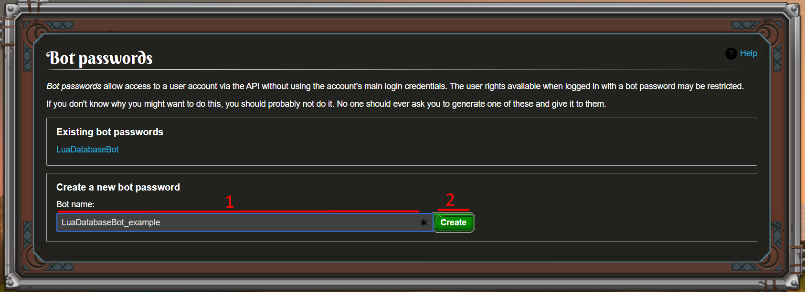
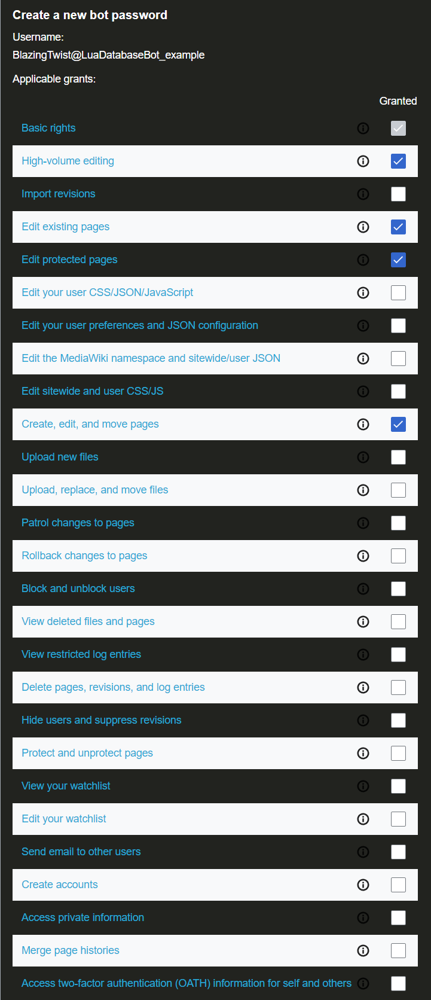
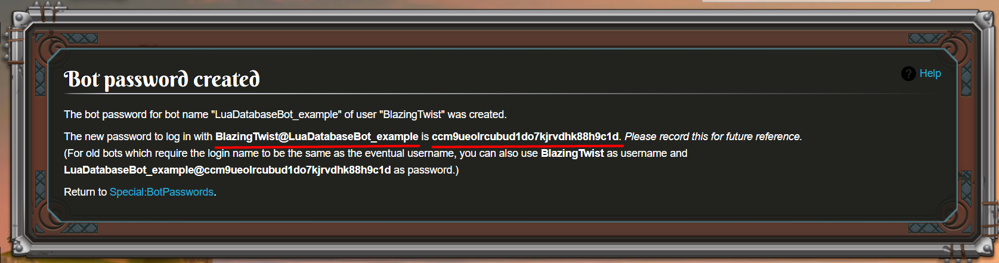
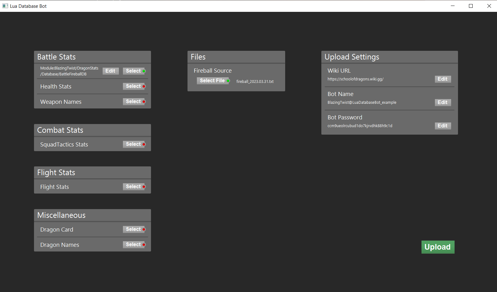
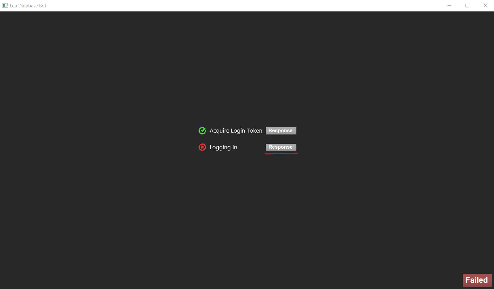
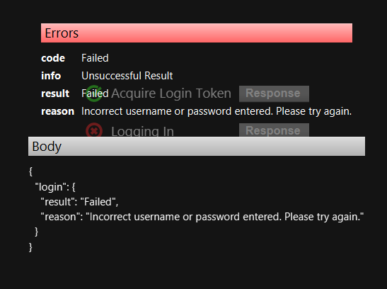

# First Time Setup

## Create a Wiki Bot Account

Navigate to the [Special:BotPasswords](https://schoolofdragons.wiki.gg/wiki/Special:BotPasswords) section of your wiki and log into your user account.

Choose a Bot name that you can easily remember (1) and click 'create' (2).

Enable these permissions for the bot:
* **High-volume editing**
* **Edit existing pages** (this is what the bot will typically do)
* **Edit protected pages** (if you want to protect the module pages, since these should not be edited manually)
* **Create, edit, and move pages** (optional, required only for the first time a module is submitted)

Click 'create' at the bottom of the page.

Time to write down the username and password of your bot account.

## Upload files with the GUI

Download and Open [SoD_LuaDatabaseBot.jar](https://github.com/BlazingTwist/SoD_LuaDatabaseBot/releases/latest).  
Select the Modules you want to upload on the left.  
Select the source-files for each module in the center.

Here is a list of source files and their corresponding (default) DiffExplorer file.
* 'Fireball Source' -> `fireballHistory\sources\<file>`
* 'Sanctuary Pet Types Source' -> `sanctuaryPetTypesHistory\sources\<file>`
* 'Weapon Name Source' -> `weaponNameHistory\sources\<file>`
* 'Squad Tactics Source' -> `squadTacticsHistory\sources\<file>`
* 'Flight Stats Source' -> `flightStatsHistory\sources\<file>`

Now edit the 'Bot Name' and 'Bot Password' on the right.

Click 'Upload' to upload the selected modules once you're done.

If you've done everything correctly, you should see something like this.

Otherwise, this window shows you which step failed, so you can fix it.  
Click 'Response' on any step to see more details.

In this case, I made a typo in the password.

